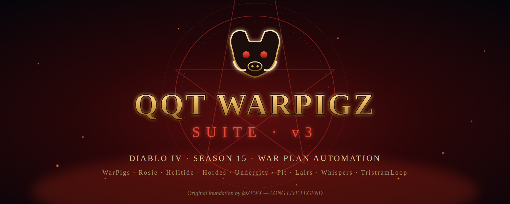

# QQT_Warpigz_v3



**All credits for the original foundation go to @ZEWX — LONG LIVE LEGEND.**

Community maintenance update: we're updating the suite, fixing obvious bugs, and working to improve performance and reliability. The original foundation belongs to @ZEWX. Existing contributors retain their credits.

**Current release: v3.3.12.** Every version is published on the [Releases page](https://github.com/forsagaxeno-afk/QQT_Warpigz_v2/releases) with an installable package. v2.2.0 and v2.2.1 were withdrawn; 2.3.0 release candidates were private test builds. **Upgrading from 2.x: plugin folders no longer carry version numbers** (for example `WarPigs-1.0.0` is now `WarPigs`); delete the old folders before copying the new ones.

**New here? Read the [step-by-step user guide](docs/GUIDE_EN.md)** (install, setup, WarPigs automation or one activity by hand, troubleshooting).

[English changelog](CHANGELOG.md) · [Audit and validation](AUDIT.md) · [Credits](CREDITS.md) · [Version rules](CONTRIBUTING.md)

## What it does

WarPug creates a War Plan in Temis. WarPigs watches the plan quests, starts the matching activity, waits for its cleanup, coordinates town services, and hands control to the next activity. SilentRaven claims completed Whisper rewards during settled visits to **Temis (`Skov_Temis`) only**. Loot Steward is not required.

v2.1.0 makes the suite load and plan under QQT's LuaJIT runtime, fixes the cross-plugin defects found by a multi-agent integration review, and enters **Infernal Hordes War Plan steps through the War Plan teleport — no Infernal Compass** (see below).

| Folder | Role | Component version |
| --- | --- | --- |
| `WarPigs` | Master orchestrator and town handoffs | 1.1.11 |
| `WarPug` | War Plan selection and creation | 1.0.17 |
| `Batmobile` | Shared navigation | 2.2.3 |
| `ArkhamAsylum` | The Pit | 2.1.4 |
| `HelltideRevamped` | Helltides (Warplan / Farm modes, tears) | 2.6.3 |
| `HordeDev` | Infernal Hordes | 2.2.7 |
| `Reaper` | Boss lairs | 1.10.6 |
| `WonderCity` | Kurast Undercity | 2.2.6 |
| `SilentRaven` | Whisper reward checks in Temis | 0.2.8 |
| `Rosie` | Town services and pickup (replaces Alfred and Looter): mythic uniques, charms and seals | 1.0.26 |

Nightmare Dungeons are not supported. WarPug excludes those nodes.

## Installation

1. Stop the controllers and close QQT before replacing source files. Back up your plugin folders, settings, custom paths, and WarPug `positions.txt` outside the scripts directory.
2. Copy **only the 10 plugin folders above** into the QQT scripts directory. **From 3.3.6 the package has no `WarRoom` folder:** delete an existing `WarRoom` folder from your scripts directory (the other plugins do not need it). Do not copy `archive`, `audit`, `docs`, `assets` or `tools` there (QQT would try to load them as plugins and print `cannot open ...\main.lua`). Keep one loaded copy of each plugin. **From 3.0 the folders have no version in their name** and keep it across updates; when upgrading from 2.x, delete `WarPigs-1.0.0`, `WarPug-1.0.0`, `Batmobile-1.0.12`, `ArkhamAsylum-1.0.6`, `HelltideRevamped-0.4`, `HordeDev-1.3.9`, `Reaper-main`, `WonderCity-main` and `SilentRaven-0.1.3` first, or QQT loads two copies.
3. Replace the SilentRaven folder completely: its modules now live under `silent_raven.*`. Restore your saved configuration as needed. Do not load old SilentRaven alongside this build.
4. **Rosie replaces Alfred and Looter**: remove (or move out of the scripts directory) your old Alfred, SteroidAlfred, AlfredTheButler-WarPigz and LooteerV3 folders — Rosie publishes the same `AlfredTheButlerPlugin` / `LooteerPlugin` APIs and yields if another provider is loaded. Rosie switches the host Auto Loot off while its pickup runs. Keep your separately installed **combat/Orbwalker** plugin; it is not bundled or replaced. Configure town, loot rules, combat, and activity settings before enabling automation.
5. Fully reload QQT. This matters for the captured module imports that fix Reaper's externally triggered `reset_run` crash.
6. Enable SilentRaven in its own menu and **Whispers in Temis (SilentRaven)** in WarPigs. WarPigs does not override SilentRaven's enable checkbox.
7. WarPug ships `positions.txt` **uncalibrated** since v2.1.0 (the calibration shipped by earlier releases is ignored so WarPug never clicks blind). Capture your own **Reroll** and **Confirm** positions in WarPug's menu after installing or updating, or restore your own backed-up `positions.txt`. Boards with a valid path confirm natively without clicks.
8. Enable WarPug for automatic plan creation, then WarPigs for orchestration. Set **Use teleport** for the existing via-Temis service cycle. While WarPigs runs, pause WarPigs rather than an activity plugin's hotkey (a hotkey pause is honoured and shown, but WarPigs then waits for that plugin). Avoid independently starting overlapping activity controllers.

`archive`, `audit`, `docs`, `assets` and `tools` are not plugins (`archive` keeps the parked WarRoom dashboard in the repository; it is not in the release package). The preserved [upstream documentation](docs/UPSTREAM_README.md) explains original menus and activity setup; its dated history describes earlier builds.

## Infernal Hordes from a War Plan (no compass)

WarPigs option **Hordes: enter via War Plan teleport (no compass)** (default ON): for a War Plan Horde step WarPigs presses the War Plan teleport itself (`warplan.teleport_to_activity()`, also with **Use teleport** off) behind the Alfred/Looter holds, logs every landing (`War Plan Horde entry: ... landed world=... zone=...`), and starts HordeDev with `enable({entry='warplan'})` only once the player is inside the Horde. In that mode HordeDev never uses an Infernal Compass, never walks or teleports to the Library, plays the (6-wave) horde, finishes even without a chest room, leaves with Leave Dungeon and reports `completed` without starting another cycle.

If three War Plan teleports do not reach the Horde, WarPigs backs off 60 s and shows the reason in its status line. A compass is used only if **Allow compass entry if the War Plan teleport fails** (default OFF) is ticked, and never after a landing in an unknown BSK zone. HordeDev used on its own (or with the option off) keeps its normal compass farming.

## Whisper behavior

On each stable Temis visit, WarPigs waits for outgoing activity cleanup and observable Alfred/Looter work (a short Looter quiet window) before requesting a reward check. An active WarPug transaction keeps priority. A Looter burst pauses a managed request instead of cancelling it; after accept the claim is never cancelled. Requests have time limits, cancellation and late-callback guards. Managed Whisper requests never teleport or change Looter settings. From 3.1.0 WarPigs also delegates while an activity runs: SilentRaven claims a ready reward on that activity's Temis stops and on Rosie's town trips (before the return portal), and SilentRaven's **Claim trip after** (default 5 minutes, 0 = off) asks Rosie for a Temis trip from the open world (Helltide) when a reward has waited that long. The same hand-off and claim trip work without WarPigs (SilentRaven *Auto-fire in town* on).

SilentRaven verifies the selected reward and observes cache receipt before reporting success. A card is rejected only when it is explicitly invalid; if a claim cannot be verified, one automatic `[SilentRaven] reward diagnostics` dump shows the host's reward fields. Unreadable state or an unconfirmed claim is not reported as completed. See its [integration contract](SilentRaven/README.md).

## Validation

QQT executes plugins with **LuaJIT (Lua 5.1 rules)**: no `table.unpack`, at most 60 upvalues and 200 locals per function. Run with Python 3, the Lua 5.4 shared library and `luajit` (the runner checks both runtimes; `--luajit require` makes a missing LuaJIT fatal):

```sh
python3 audit/check_release.py --base <previous release tag>
python3 audit/tests/run_tests.py --luajit require
```

These checks compile runtime Lua under Lua 5.4 and LuaJIT, reject Lua 5.2+ library use, report functions near the LuaJIT limits, and exercise actual modules with host-shaped test doubles. `audit/tests/test_joint_suite.lua` loads the nine War Plan plugins together in one emulated QQT host (per-plugin module caches, one shared `_G`, caller-context `require` detection) and runs the War Plan loop end to end. See [AUDIT.md](AUDIT.md) and the [live checklist](audit/LIVE_CHECKLIST.md). They do not run Diablo IV or QQT's native loader. Current packed Alfred/Looter internals, real NPC behavior, native navigation, where the War Plan teleport lands for a Horde, the host's reward-selection conventions, and the reported LooteerV3 `approach_stall` still need live verification. Performance work removes identified unnecessary operations; no measured live FPS or throughput improvement is claimed.
